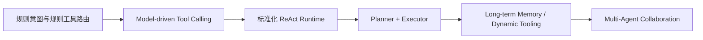

# AI 服务从 0 到 1 的架构选型与 ReAct 面试文档

## 1. 这份文档怎么用

这份文档不是源码设计稿，而是面向：

- 面试
- 述职
- 架构汇报
- 技术分享

它重点回答四类问题：

1. 这个 AI 服务从 0 到 1 是怎么搭起来的
2. 为什么架构、模式、数据库这样选
3. 为什么从原来的 `tool-calling loop` 继续演进到 `ReAct`
4. 这次重构到底解决了什么问题

如果时间很短，可以直接讲：

- 一分钟版本
- 三分钟版本

如果对方继续深挖，再展开后面的章节。

## 2. 一句话概括

我做的不是一个“接上大模型就结束”的 Demo，而是从 0 到 1 搭了一套可以持续演进的 AI 服务底座：先用 PostgreSQL 单栈把会话、文件、向量检索和 BM25 检索收敛在一起，再从规则路由升级到 model-driven tool-calling，最后进一步重构成标准化的 ReAct Runtime，把推理、动作、状态、安全边界、终止策略和可观测性拆成独立层，解决了 AI 服务难扩展、难排查、难控制的问题。

## 3. 项目背景

这个 AI 服务不是通用聊天机器人，而是一个面向工作台和文档场景的企业级 AI 助手，核心要解决三类问题：

- 用户问问题时，能从自己的资料中检索出可信证据
- AI 不只是回答，还能调用系统能力去获取信息
- 整个服务要能持续扩展，而不是每加一个能力就重写一遍主流程

换句话说，这个项目从一开始就不是“做一个聊天框”，而是“做一个可以承接知识检索、工具调用、流程中断和后续复杂任务编排的 AI 服务底座”。

## 4. 从 0 到 1 的演进路径

### 4.1 第一阶段：先把底座搭起来

0 到 1 阶段我优先做的不是 Agent，而是把 AI 服务落地所需的基础设施补齐：

- FastAPI 接口层
- PostgreSQL 业务表
- 文件上传与元数据管理
- 文档解析、清洗、切块、向量化链路
- 向量检索与多路召回
- 会话记录和消息引用落库
- SSE 流式返回

为什么先做这些？

因为没有这些底座，AI 服务只能停留在“回答一句话”的 Demo 阶段，无法承接真实业务。

### 4.2 第二阶段：从规则路由走到 tool-calling

有了底座之后，系统一开始采用的是规则意图识别和规则工具路由：

- 先判断用户问题属于什么意图
- 再决定是否查文件、查知识库、还是走普通对话
- 工具调用由后端写死

这个阶段的优点是可控，但缺点是明显的：

- 扩展一个新能力要加一层规则
- 模型没有真正决策权
- 多工具串联能力差
- 后端容易变成巨大的 if-else 中心

所以第二步升级成了 `tool-calling loop`：

- 把工具 schema 直接暴露给模型
- 模型决定是否调用工具
- 后端负责参数校验、执行和错误兜底

### 4.3 第三阶段：从 tool-calling loop 升级到 ReAct

继续往前走，会发现单纯有 `tool-calling loop` 还不够。

真正的问题变成：

- loop 的状态如何管理
- 工具调用前如何做 guardrails
- 什么时候停止
- 如何避免重复 action 和空转
- 如何记录每个 step 的 reason / action / observation
- 如何在不重写业务接口的前提下完成 runtime 分层和后续演进

这时就需要从“能力 loop”升级成“标准化 ReAct Runtime”。

## 5. 为什么要选这些技术栈

## 5.1 为什么选 FastAPI

我选 `FastAPI` 的主要原因是：

- 适合快速构建 AI 编排服务
- 接口定义清晰
- SSE 支持简单
- 适合承接轻业务 + 强编排的后端场景

这个项目的后端不是重事务业务系统，而是“AI orchestration + retrieval + tool access”型服务，FastAPI 非常合适。

## 5.2 为什么数据库选 PostgreSQL 单栈

这是一个很关键的架构选择。

我没有在 0 到 1 阶段就上：

- 独立向量数据库
- 独立搜索引擎
- 独立会话存储
- 独立 trace 存储

而是优先选择 PostgreSQL 单栈承载：

- 业务表
- 文件表
- 会话消息表
- 消息引用表
- 向量表
- BM25 检索能力
- Agent trace 表

具体实现上：

- `pgvector` 负责向量检索
- `pg_search` 负责 BM25 检索
- 事务数据、检索数据、会话数据都落在 PostgreSQL

### 为什么这样选

因为 0 到 1 阶段最重要的是：

- 链路闭环
- 架构收敛
- 低运维成本
- 快速迭代

如果一开始就拆成多存储系统，会立即引入：

- 数据同步问题
- 多库运维问题
- 一致性问题
- 调试复杂度

我更倾向于在前期用单栈做出稳定系统，等数据规模和访问压力到了，再考虑拆分。

## 5.3 为什么检索用多路召回

我没有只做单路向量检索，而是做了：

- 向量召回
- BM25 召回
- 规则召回

原因很直接：

- 向量检索擅长语义相似
- BM25 擅长关键词、术语、编号、错误码、接口名
- 规则召回适合补“最近上传的 PDF”“某个文件名”这种确定性场景

这三者结合，才能更稳地服务 Agent。

## 6. 为什么不是一直停留在 tool-calling loop

很多面试官会问一个问题：

“既然已经有 tool-calling loop 了，为什么还要继续做 ReAct 重构？”

我的回答是：

因为 `tool-calling loop` 解决的是“模型可以调用工具”，而 `ReAct` 解决的是“AI 服务如何以工程化方式稳定运行和持续演进”。

两者不是同一个层级的问题。

### tool-calling loop 解决的问题

- 模型获得工具使用能力
- 支持单轮内多次调用工具
- 让工具选择从后端规则转移给模型

### tool-calling loop 没有彻底解决的问题

- 状态如何管理
- 停止条件如何标准化
- 调用前边界如何校验
- step 级 trace 如何持久化
- runtime 如何解耦出可替换 backend
- 如何兼容不同决策模式和输出协议

所以当系统从“能跑”进入“可维护、可扩展、可观测”阶段时，就必须继续往 ReAct 架构演进。

## 7. 为什么选 ReAct 模式

### 7.1 ReAct 的本质

在工程视角里，ReAct 不是一句 prompt 技巧，而是一种运行模式：

- Reason：模型思考下一步做什么
- Act：触发动作或工具调用
- Observe：接收外部结果
- Continue or Stop：继续推理或终止

这个模式的价值在于它天然适合处理：

- 多步任务
- 工具调用
- 动态环境反馈
- 需要边走边判断的执行流程

### 7.2 为什么它适合当前项目

因为当前项目不是纯聊天，而是具备明显的“思考 -> 动作 -> 观察 -> 再思考”结构：

- 用户问的是文档问题，AI 可能先检索知识库
- 用户问的是文件详情，AI 可能先查文件
- 用户问的是工作台用户，AI 可能先查用户
- 用户要求流程图生成，AI 可能先进入 human-in-the-loop 选择文件

这类任务如果只靠一次模型回答，效果和可控性都会很差。

ReAct 更适合，因为它允许系统：

- 基于中间 observation 调整下一步
- 在工具失败时回填错误并重试
- 在需要用户确认时暂停
- 在达到停止条件时强制收敛

### 7.3 为什么不一步到位做 planner-executor

从架构师视角，很多人容易犯一个错误：一上来就把系统设计得很重。

我没有一开始就做：

- planner
- executor
- 多 agent
- 复杂长期记忆

原因是当前业务阶段还不需要这么重的结构。

ReAct 是一个更合适的中间层：

- 比简单 tool-calling 更强
- 比 planner-executor 更轻
- 足够覆盖当前单助手、多步轻任务、可中断工作流的需求

这是一种非常典型的分阶段架构策略。

## 8. 为什么当前还保留 LangGraph

这也是一个很重要的面试点。

当前架构里并不是“完全抛弃 LangGraph”，而是：

- 把 `LangGraph` 从架构中心降级为当前的图执行外壳和运行时承载层
- 真正的 Agent 运行逻辑下沉到 `AgentFacade` 和 runtime 模块

我这样做的原因是：

### 8.1 LangGraph 仍然有现实价值

它已经提供了：

- streaming
- checkpoint
- graph shell

如果在重构阶段一次性全部去掉，风险会比较高。

### 8.2 先抽 runtime，再决定是否继续替换执行外壳更稳

当前通过 `AgentRuntime` 抽象，先把推理、状态、工具、安全边界这些核心职责从大 service 中拆出来，再由 `LangGraphAgentRuntime` 承载主链路执行。

这让系统先完成架构分层，再决定后续是否还需要继续替换执行外壳。

这是典型的“渐进式重构”，而不是“大爆炸式重写”。

## 9. ReAct 重构解决了什么问题

这个问题是面试和汇报里最应该讲清楚的。

### 9.1 解决了职责耦合问题

以前一个 service 承担太多职责：

- prompt
- loop
- tool execution
- error handling
- persistence
- streaming

重构之后拆成：

- Facade
- Runtime
- Reasoning
- Tools
- State
- Guardrails
- Termination
- Tracing

这样每层职责更清晰，扩展和测试都更容易。

### 9.2 解决了“模型建议直接等于执行”的风险

以前只要模型给出 tool call，系统很容易直接往下执行。

现在通过 `Guardrails`，系统可以在执行前做：

- 用户上下文校验
- 参数完整性校验
- 工具匹配校验
- 确认要求校验

这让系统从“模型建议”变成“模型建议 + 平台裁决”。

### 9.3 解决了停止条件分散的问题

以前 loop 很容易靠隐式 if-else 控制退出。

现在通过 `TerminationController`，停止条件明确包括：

- final response
- waiting input
- final answer
- max steps
- repeated action
- empty steps

这让系统更可控，也更容易压测和调优。

### 9.4 解决了 AI 服务难排查的问题

AI 系统最难的一点是：很多时候最终结果错了，但你不知道中间哪里错了。

这次重构通过 `AiAgentTrace` 把 step 级过程落库：

- reason
- action
- observation
- termination

这样无论是调试、排障、审计还是后续运营分析，都有了数据基础。

### 9.5 解决了后续演进困难的问题

如果没有 runtime 抽象，后面想做：

- 新工具
- 新停止条件
- 新安全策略
- 新 memory 策略
- 新 backend

都会继续堆在一个 service 里。

现在有了分层之后，系统已经具备平台化演进的基础。

## 10. 架构选型的核心思路

如果面试官问“你的架构思维是什么”，我建议这样回答：

### 10.1 先解决闭环，再解决优雅

0 到 1 阶段先把：

- 文件上传
- 向量化
- 检索
- 会话
- 流式输出

做成闭环。

### 10.2 先单栈收敛，再逐步解耦

先用 PostgreSQL 单栈把系统收住，避免一开始系统组件过多。

### 10.3 先让模型获得动作能力，再把动作平台化

先从规则路由走到 `tool-calling loop`，再继续把 loop 升级成 ReAct runtime。

### 10.4 先做渐进式重构，而不是大爆炸重写

当前保留 `LangGraph`，同时引入 runtime 抽象，就是典型的低风险重构策略。

## 11. 可以直接讲的 1 分钟版本

这个 AI 服务我是按“企业级可演进 AI 后端”去设计的。0 到 1 阶段先用 FastAPI 和 PostgreSQL 单栈把文件上传、向量化、会话消息、引用关系、向量检索和 BM25 检索全部收敛在一个系统里，再通过多路召回把 RAG 质量做稳。AI 编排上，最开始是规则路由，后面升级成 model-driven tool-calling，让模型自己决定是否调用工具。再往后我发现光有 tool-calling loop 不够，因为状态管理、停止条件、边界控制和排障都还不标准，所以继续重构成 ReAct Runtime，把 reasoning、tool、state、guardrails、termination 和 tracing 拆成独立模块。这样解决了系统难扩展、难排查、难控制的问题，也为后续 planner、多 agent 和长期记忆打下了基础。

## 12. 可以直接讲的 3 分钟版本

这个项目的核心不是做一个聊天接口，而是做一套可持续演进的 AI 服务底座。0 到 1 阶段，我先做的是基础能力闭环，包括文件上传、解析、清洗、切块、embedding、向量入库、检索、多轮会话、消息引用和 SSE 流式输出。数据库我没有一开始就拆成很多中间件，而是选了 PostgreSQL 单栈，结合 `pgvector` 和 `pg_search` 同时承接事务数据、向量检索和 BM25 检索，这样前期系统复杂度最低。

AI 编排上，一开始是规则意图识别和规则工具路由，这样能快速落地，但扩展性很差。接着我把系统升级成 tool-calling loop，让工具 schema 直接暴露给模型，模型自己决定是否调用工具、调用哪个工具。这样解决了模型无法自主动作的问题。但继续做下去我发现，仅有 tool-calling loop 还不够，因为状态推进、终止条件、执行前边界、step 级 trace 仍然不够标准化。

所以我进一步把系统重构成 ReAct Runtime。具体来说，我把 AI 服务拆成了 Facade、Runtime、Reasoning、Tools、State、Guardrails、Termination 和 Tracing 几层。模型负责给出下一步建议，Runtime 负责循环推进，Guardrails 负责判断某个动作是否允许执行，Termination 负责决定何时停止，Tracer 负责把每一步的 reason、action、observation 和 termination 落到数据库里。这样系统从“能跑”升级到了“可控、可观测、可扩展”。

同时，我没有一步到位把 LangGraph 全部删掉，而是把它从架构中心降级成图执行外壳和运行时承载层。当前系统主链路只有一套 LangGraph-backed ReAct runtime，这样可以先完成平台化收口，而不是高风险重写。这个方案对企业级系统更现实，因为它兼顾了业务连续性和架构演进。

## 13. 面试官常见追问

### 13.1 为什么不用独立向量数据库

因为 0 到 1 阶段最重要的是快速形成稳定闭环，而不是一开始就把存储拆得很重。PostgreSQL 配合 `pgvector` 和 `pg_search` 已经能覆盖当前事务、向量、BM25 三类需求，部署和调试成本最低。

### 13.2 为什么不一直用规则路由

规则路由适合早期落地，但扩展成本高，而且模型没有真实动作能力。能力一多，后端会迅速膨胀成条件分支中心，维护成本会越来越高。

### 13.3 为什么不是 tool-calling 就结束

因为 tool-calling 解决的是“模型能调用工具”，但没有解决“AI 服务如何工程化地稳定运行”。ReAct 重构补上的是 runtime、状态、安全、终止和可观测这些平台能力。

### 13.4 为什么当前不直接做多 agent

因为当前业务阶段还没有复杂到必须上多 agent。多 agent 架构不仅带来更高复杂度，也会增加状态同步、协调和排障成本。现阶段 ReAct 是复杂度和收益更平衡的选择。

### 13.5 为什么当前还保留 LangGraph

因为它已经提供了成熟的 streaming 和 checkpoint 能力。重构时直接全部替换风险太高，所以我先抽 runtime 再逐步迁移 backend，这是更稳妥的工程策略。

## 14. 未来演进怎么讲

从架构师角度，面试里不应该只讲“现在是什么”，还要讲“下一步怎么走”。

我建议按下面这条路线讲：

每一阶段解决的问题分别是：

- 规则路由：先把业务闭环跑起来
- Tool Calling：让模型获得动作能力
- ReAct Runtime：让系统具备工程化运行能力
- Planner + Executor：支持更复杂长链路任务
- Long-term Memory / Dynamic Tooling：支持平台化成长
- Multi-Agent：支持更复杂的组织化协作

## 15. 最后的结论

如果让我用一句架构师视角的话来总结这次重构，我会这样说：

这次我做的不是“把一个会调用工具的聊天机器人做出来”，而是把 AI 服务从“功能型应用”推进成“平台型运行时”。前一阶段解决的是模型能不能做事，这一阶段解决的是系统如何安全、稳定、可观测地让模型做事。ReAct 模式之所以重要，不是因为它是一个流行名词，而是因为它正好把推理、动作、观察和停止这四个核心能力，变成了可以工程化管理的边界。

## 16. 面试结束前的压轴一句

如果对方想听一个更凝练的总结，可以直接说：

我把这个 AI 服务的演进分成三步看。第一步是把企业级 AI 所需的上传、向量化、检索、会话和流式输出底座搭起来；第二步是从规则路由升级到 model-driven tool-calling，让模型拥有自主动作能力；第三步是继续把 tool-calling 升级成标准化 ReAct Runtime，把状态、安全、终止和可观测性补齐。这样系统才真正具备长期演进的架构基础。
