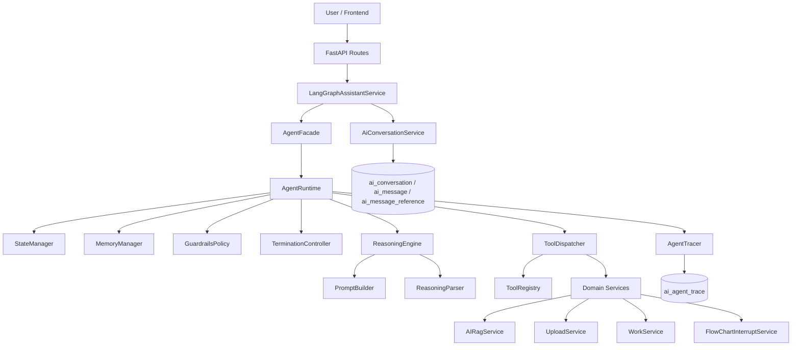
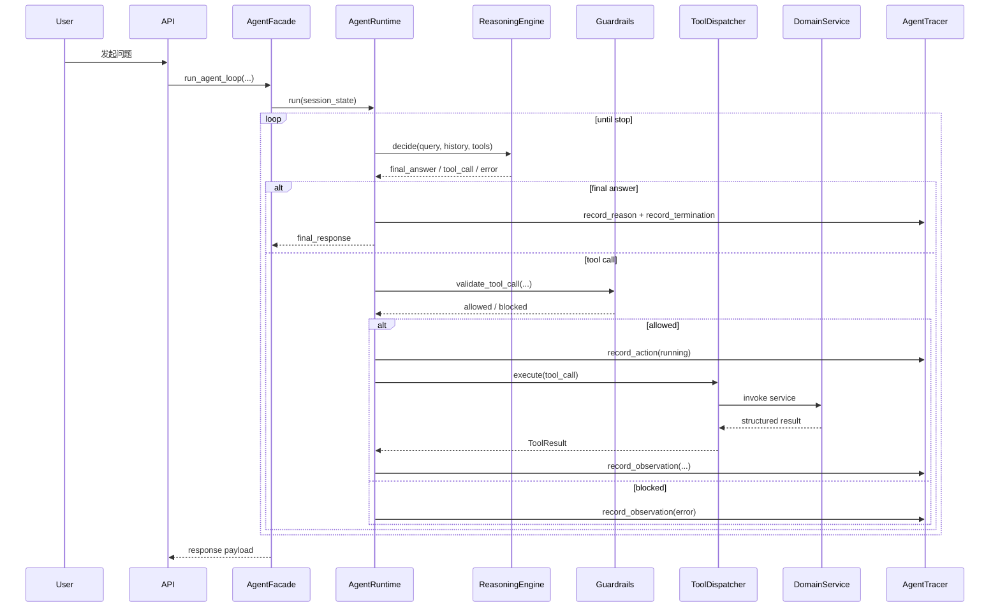
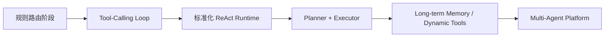

# AI 服务 ReAct 架构文档

## 1. 文档定位

本文是当前项目 AI 服务 `ReAct` 模式的内部架构文档，目标不是描述一个抽象的 Agent 理论模型，而是基于当前仓库中的真实实现，系统梳理：

- AI 服务是如何从早期 `tool-calling loop` 继续演进到当前 `ReAct` 形态的
- 当前 `ReAct` 模式的真实模块边界、执行链路、状态流转、数据落库方式
- 为什么当前架构仍然保留 `LangGraph` 外壳而不是彻底去掉
- 当前方案已经解决了什么问题，还没有解决什么问题
- 后续可以如何继续演进到更标准的平台化 Agent 架构

本文主要面向：

- 后端开发
- AI 平台开发
- 架构设计与评审
- 后续接手该模块的维护人员

## 2. 背景与演进动因

### 2.1 第一阶段：规则驱动的 AI 助手

最早阶段，AI 助手并不是一个真正意义上的 Agent，而更接近一个“AI 编排服务”：

- 先做规则意图识别
- 再做规则工具识别
- 命中规则后由后端直接选择工具
- 未命中时进入普通聊天或 RAG 摘要链路

这一阶段的优点是：

- 落地快
- 可控性强
- 适合 0 到 1 阶段快速把对话与检索链路跑通

但问题也很明显：

- 工具选择权在后端规则，不在模型
- 多工具串联能力弱
- 能力扩展依赖新增分支和条件判断
- Runtime、Prompt、工具协议、持久化、异常恢复耦合严重

### 2.2 第二阶段：tool-calling loop

随后，系统进入 `tool-calling loop` 阶段。这个阶段的核心变化是：

- 不再完全依赖后端规则做工具路由
- 工具 schema 直接暴露给模型
- 模型决定是否调用工具、调用哪个工具、是否继续调用
- 后端负责参数校验、工具执行、错误回填和边界控制

这一步解决了“模型不具备自主动作能力”的问题，但仍然存在几个工程瓶颈：

- loop 还主要是能力层面的 loop，而不是平台层面的 runtime
- 状态推进、终止策略、trace、guardrails 仍然没有形成稳定模块边界
- `LangGraphAssistantService` 依然承载了较重的编排职责
- tool-calling 解决了“调用工具”的问题，但没有完整回答“如何做标准 ReAct Agent 平台”的问题

### 2.3 第三阶段：标准化 ReAct Runtime

当前项目进入的是第三阶段：以 `AgentFacade + Runtime + Reasoning + Tool + State + Guardrails + Termination + Tracing` 为核心的标准化 ReAct 架构。

注意这里的关键点不是“是否使用了 ReAct 这个术语”，而是是否完成了这几个工程抽象：

- 模型负责思考和建议下一步
- Runtime 负责循环推进和是否允许执行
- Tool 层负责真实外部动作
- State 负责运行态状态机
- Guardrails 负责执行前校验
- Termination 负责停止条件
- Tracing 负责 step 级观测与审计

这才是当前架构真正的重构重点。

## 3. 当前架构在代码中的真实落点

当前实现的关键代码入口如下：

- Agent API 路由：`backend/app/api/routes/agent.py`
- 统一入口门面：`backend/app/ai/agent/facade.py`
- LangGraph 外层服务：`backend/app/ai/services/langgraph_assistant.py`
- Runtime 抽象与实现：
  - `backend/app/ai/agent/runtime/base.py`
  - `backend/app/ai/agent/runtime/langgraph_runtime.py`
- 推理层：
  - `backend/app/ai/agent/reasoning/prompt_builder.py`
  - `backend/app/ai/agent/reasoning/engine.py`
  - `backend/app/ai/agent/reasoning/parser.py`
- 工具层：
  - `backend/app/ai/agent/tools/registry.py`
  - `backend/app/ai/agent/tools/dispatcher.py`
- 状态层：
  - `backend/app/ai/agent/state/models.py`
  - `backend/app/ai/agent/state/manager.py`
- 安全与终止：
  - `backend/app/ai/agent/guardrails/policy.py`
  - `backend/app/ai/agent/termination/controller.py`
- 观测层：
  - `backend/app/ai/agent/tracing/tracer.py`

## 4. 总体分层架构

### 4.1 架构图



### 4.2 三层理解

可以把当前 AI 服务理解成三层：

#### 第一层：API / Service 外壳层

负责：

- 暴露 HTTP / SSE 接口
- 加载会话历史
- 构建 LangGraph 图
- 持久化最终消息
- 为 Runtime 提供运行上下文

这一层的代表是：

- `routes/agent.py`
- `LangGraphAssistantService`

#### 第二层：Agent Runtime 层

负责：

- 维护 ReAct 主循环
- 推动 step 状态演进
- 调用模型做决策
- 校验工具是否允许执行
- 执行工具并记录 observation
- 判断是否终止
- 记录 trace

这一层是当前重构的核心。

#### 第三层：Tool / Domain Environment 层

负责：

- 向 Agent 暴露可调用能力
- 调用真实业务服务
- 返回结构化结果
- 承接 RAG、上传文件、人员查询、流程图中断等领域能力

## 5. 当前执行入口与链路

### 5.1 `/agent` 路由

当前新 Agent API 入口在 `backend/app/api/routes/agent.py`，暴露了三类能力：

- 新建线程 `POST /agent/threads`
- 恢复线程 `POST /agent/threads/{thread_id}/resume`
- 事件流 `GET /agent/threads/{thread_id}/events`

这说明当前架构已经不再把 AI 助手仅仅当成一个“单轮聊天接口”，而是明确向线程化、可恢复执行演进。

### 5.2 `LangGraphAssistantService` 的角色变化

当前 `backend/app/ai/services/langgraph_assistant.py` 仍然存在，但它的角色已经从“全栈大 service”收敛为：

- LangGraph 图定义外壳
- SSE 事件桥接
- 历史消息加载
- 响应组装和最终落库

当前图已经简化为：

```text
load_history -> run_agent_loop -> build_response -> persist_message
```

这点很重要，因为它说明：

- `LangGraph` 仍然存在
- 但 `LangGraph` 已经不再是业务决策中心
- 真正的 agent 决策循环已经下沉到 `AgentFacade` 和当前 runtime 实现

## 6. ReAct Runtime 的核心设计

### 6.1 为什么要引入 `AgentFacade`

`backend/app/ai/agent/facade.py` 是当前架构中的统一门面，它的职责是：

- 统一装配 `StateManager`
- 统一装配 `PromptBuilder` 和 `ReasoningEngine`
- 统一装配 `ToolDispatcher`
- 统一装配 `GuardrailsPolicy`
- 统一装配 `TerminationController`
- 统一装配 `MemoryManager`
- 统一选择并装配当前 runtime 实现

它的价值在于把“创建和拼接 agent 运行时组件”的逻辑从具体 service 中抽离出来。

这使得：

- 上层 API 不需要知道底层用的是哪个 runtime
- 下层 runtime 可以逐步替换，而不影响上层接口
- 整个系统从“单个 service 承载所有职责”变成“门面 + runtime 分层”的结构

### 6.2 当前 Runtime 形态

当前激活的 runtime 实现是 `LangGraphAgentRuntime`。

它的特点是：

- ReAct 主循环已经收口到 runtime 层
- `LangGraph` 主要承担 graph shell、streaming 和 checkpoint 能力
- `AgentFacade` 负责统一装配 runtime 所需组件，而不是在上层 service 中散落编排逻辑

这意味着当前系统并不是“LangGraph 直接承载全部 agent 决策”，而是“LangGraph 外壳 + 自有 ReAct runtime 分层”。

### 6.3 ReAct 的一个 step 是怎么跑的

当前 ReAct step 的本质流程是：

1. Runtime 启动一个新 step
2. `ReasoningEngine` 读取 prompt、历史、memory summary，向模型发起决策请求
3. 模型返回：
   - final answer
   - tool calls
   - legacy text ReAct action
   - tool argument error
4. 如果是 tool call：
   - `GuardrailsPolicy` 先校验
   - `ToolDispatcher` 再执行
   - observation 进入 step state 和 trace
5. `TerminationController` 判断是否应继续或停止
6. 停止后由 facade / service 组装最终响应和持久化

### 6.4 单轮时序图



## 7. Reasoning 层设计

### 7.1 `ReasoningEngine` 的职责

`backend/app/ai/agent/reasoning/engine.py` 当前承担的是“推理决策标准化入口”，主要职责包括：

- 使用 `PromptBuilder` 组装 messages
- 决定是否把 tools schema 发给模型
- 调 OpenAI `chat.completions`
- 解析模型输出
- 转换成统一 `AgentDecision`

这意味着上层 runtime 不需要关心模型返回是：

- OpenAI 原生 `tool_calls`
- 普通文本
- 还是 legacy ReAct 风格文本

它只消费统一的 `AgentDecision`。

### 7.2 为什么当前要同时兼容两种 ReAct 表达

当前 `ReasoningEngine` 兼容两类输出：

1. OpenAI tool-calling 输出
2. 文本式 ReAct 输出，也就是 `Thought / Action / Final Answer`

这是一种过渡期兼容设计，价值在于：

- 不把整个 runtime 强绑定到单一模型输出协议
- 保留对文本式 ReAct 协议的解析兼容
- 在底层模型行为不稳定或需要 fallback 时，仍有解析空间

这也说明当前项目对 ReAct 的理解不是“只能依赖某一种 SDK 的 tool_call 格式”，而是“把思考、动作、观察、终止抽象成统一运行协议”。

### 7.3 PromptBuilder 的意义

虽然具体 prompt 文案不在本文展开，但 `PromptBuilder` 的架构意义很明确：

- 上下文控制不再散落在 runtime 中
- 历史消息裁剪、memory summary、decision mode 统一由 prompt builder 处理
- 未来若切换模型、扩展 system prompt、增加工具协议约束，改动点集中

## 8. Tool 层设计

### 8.1 为什么工具协议要集中化

当前工具定义集中在 `backend/app/ai/agent/tools/registry.py`。

每个工具定义至少包括：

- `name`
- `description`
- `parameters`
- `output_schema`
- `idempotent`
- `requires_confirmation`
- `required_scopes`
- `retry_policy`
- `backend_metadata`

这意味着工具已经不再只是一个随手可调用的 Python 方法，而是一个“具备调用协议、权限语义、重试语义、后端绑定语义”的平台能力单元。

### 8.2 当前暴露给 Agent 的能力

当前注册的核心工具包括：

- `query_users`
- `list_recent_files`
- `get_file_detail`
- `search_knowledge_base`

它们分别绑定到：

- `WorkService`
- `UploadService`
- `AIRagService`

这表明当前 Agent 的真实外部环境已经包括：

- 工作台用户信息
- 文件列表与文件详情
- 知识库检索

### 8.3 `ToolDispatcher` 为什么独立存在

`backend/app/ai/agent/tools/dispatcher.py` 负责：

- 查找工具定义
- 参数校验
- 绑定上下文用户
- 调用后端 service
- 捕获异常
- 返回标准化 `ToolResult`

它的关键价值是把“工具协议”与“工具执行”分开：

- `Registry` 决定系统有哪些能力
- `Dispatcher` 决定一次调用如何被执行和如何失败

这使得后续新增工具时不会把执行逻辑散落到各个 runtime 中。

## 9. State / Memory / Guardrails / Termination

### 9.1 State：运行态状态机

运行态状态定义在 `backend/app/ai/agent/state/models.py`。

核心对象包括：

- `AgentSessionState`
- `AgentStepState`
- `ToolCallRecord`
- `ToolObservationRecord`

这里的设计非常关键，因为它明确区分了：

- 会话级状态
- step 级状态
- tool call 历史
- observation 历史

这比把所有字段平铺在一个 dict 里要清晰得多。

### 9.2 StateManager：状态推进器

`backend/app/ai/agent/state/manager.py` 负责：

- 创建 session
- 启动 step
- 记录工具调用
- 记录工具 observation
- 统计空转次数
- 统计重复 action
- 设置 pending action
- 设置 final response

这意味着 runtime 自己不需要手写大量“字段怎么改、计数怎么加”的细节逻辑，状态推进有了集中管理点。

### 9.3 Memory：当前仍是轻量短期记忆

当前项目已经有 `MemoryManager` 抽象，但总体上仍属于轻量短期记忆阶段：

- 重点服务运行时上下文压缩
- 没有引入真正长期学习型 memory
- 没有把记忆系统做成复杂召回平台

这种取舍是合理的，因为当前阶段最重要的是先把 runtime 平台能力做稳定，而不是过早把记忆系统复杂化。

### 9.4 Guardrails：模型建议不等于系统允许

`GuardrailsPolicy` 是当前 ReAct 重构中很重要的一层边界控制。

它至少负责校验：

- 当前 user context 是否存在
- tool name 和 definition 是否匹配
- 必填参数是否存在
- 某些工具是否需要显式确认

这层的架构意义是：

- 模型负责建议
- 系统负责裁决

如果没有 guardrails，模型返回的 tool call 会直接变成执行动作，系统会失去业务边界和安全边界。

### 9.5 Termination：停止条件从隐式 if-else 变成显式策略

`TerminationController` 当前负责的停止条件包括：

- 已经产生 final response
- 进入 `waiting_input`
- 模型已经给出 final answer
- 达到最大步数
- 重复 action 过多
- 连续空转过多

这一层的意义很大，因为它把“什么时候停止”从 runtime 代码中的隐式流程，提升成了一个可复用、可调优、可测试的独立策略模块。

## 10. 观测与可审计设计

### 10.1 为什么需要 step 级 tracing

在 AI 系统里，最终 answer 只解决“用户看到了什么”，但并不能解决：

- 为什么会调用这个工具
- 为什么会失败
- 为什么重复空转
- 为什么提前终止
- 为什么某一步没有按预期检索到结果

所以当前引入了 `AgentTracer` 抽象。

### 10.2 Tracer 的两套实现

当前 tracer 包括：

- `NoopAgentTracer`
- `SqlAlchemyAgentTracer`

这意味着 tracing 对调用方是可插拔的：

- 本地测试可以无副作用运行
- 实际业务环境可以落到数据库

### 10.3 `ai_agent_trace` 表的定位

`backend/app/models/ai.py` 中定义的 `AiAgentTrace` 表，用来持久化：

- `conversation_id`
- `session_id`
- `step_index`
- `phase`
- `decision_type`
- `tool_name`
- `tool_args_json`
- `observation_json`
- `status`
- `reason_summary`
- `error_code`
- `error_message`
- `created_at`

这张表本质上是“运行态审计表”，而不是用户消息表。

### 10.4 为什么 trace 和 message 分开落库

当前落库方式明确分成两类：

#### 业务消息层

- `AiConversation`
- `AiMessage`
- `AiMessageReference`

用于保存：

- 用户看到的会话和消息
- AI 回答内容
- 消息引用的文件和片段

#### 运行态审计层

- `AiAgentTrace`

用于保存：

- step 级 reason / action / observation / termination
- 错误码和错误信息
- 调用参数和 observation 摘要

这种分层非常重要，因为：

- 用户消息是产品层数据
- trace 是平台层数据
- 两者保留周期、查询方式、审计价值都不同

## 11. RAG 与数据库设计

### 11.1 RAG 不是独立子系统，而是 Agent 可调用工具的一部分

当前 `search_knowledge_base` 工具最终会调用 `AIRagService.retrieve(...)`。

这说明 RAG 在当前架构中的位置已经明确：

- 不再只是一个独立问答链路
- 而是 Agent environment 中的一个标准外部能力

### 11.2 为什么数据库选 PostgreSQL 单栈

当前项目并没有单独引入独立向量数据库，而是选择：

- PostgreSQL 负责事务数据
- `pgvector` 负责向量检索
- `pg_search` 负责 BM25 检索

支撑证据包括：

- `backend/app/services/pgvector_service.py`
- `backend/sql/004_add_pg_search_bm25.sql`
- `backend/sql/003_add_dual_channel_vector_fields.sql`

这样选的核心原因是：

- 0 到 1 阶段优先降低系统复杂度
- 事务数据、文件元数据、会话数据、检索数据共用一个存储底座
- 便于调试、部署和运维
- 避免多存储系统带来的双写、一致性和运维成本

### 11.3 当前检索模式

当前 RAG 已经不是单路向量检索，而是多路召回：

- 向量召回
- BM25 召回
- 规则召回

最后在 `AIRagService` 内进行融合和 rerank。

这套检索能力与 ReAct 的关系是：

- ReAct 负责决定是否要检索
- RAG 负责真正返回高质量 evidence
- 两者不是替代关系，而是“智能调度层”和“检索能力层”的关系

## 12. 当前 ReAct 架构解决了什么问题

当前重构不是一次“名称升级”，而是确实解决了几个实质问题。

### 12.1 从“大 service”走向模块化 runtime

原本很多职责堆在 `LangGraphAssistantService`，现在被拆成：

- Facade
- Runtime
- Reasoning
- Tool
- State
- Guardrails
- Termination
- Tracing

这解决了：

- 职责耦合
- 代码不可维护
- 后续扩展困难

### 12.2 工具调用从能力点升级为平台协议

工具现在不再只是“能调一下某个 service”，而是具备：

- schema
- output schema
- retry policy
- confirmation 语义
- scope 语义
- backend binding metadata

这让工具体系具备平台化基础。

### 12.3 停止条件和安全边界显式化

当前的 guardrails 和 termination 让系统从“模型说了算”变成：

- 模型负责建议
- runtime 负责执行策略
- guardrails 负责边界校验
- termination 负责停止条件

这使系统变得更可控、更可测试。

### 12.4 运行可观测性显著提升

有了 `AiAgentTrace` 之后，可以从 step 维度排查：

- reason 是否异常
- tool call 是否失败
- observation 内容是否异常
- 为什么终止

这为后续监控、审计、调优和事故排查提供了基础。

## 13. 当前边界与不足

当前架构已经进入标准化 ReAct 阶段，但仍然有明确边界。

### 13.1 仍处于“渐进式重构”而非“彻底替换”

当前系统仍保留：

- `LangGraphAssistantService`
- `LangGraphAgentRuntime`
- LangGraph 图与 checkpoint 外壳

这说明现阶段是“平台抽象先落地，再逐步迁移 backend”，而不是一次性切断旧链路。

### 13.2 Memory 仍然偏轻量

当前 `MemoryManager` 更偏向：

- 运行时短期摘要
- observation 摘要
- 轻量历史裁剪

尚未形成：

- 长期记忆
- 记忆检索
- 用户偏好持续学习
- 任务型状态跨会话继承

### 13.3 还不是 planner-executor 架构

当前 runtime 仍然是单体 ReAct loop。

它适合：

- 单轮工具选择
- 多步轻量动作
- 可控的工作流型问答

但还不适合：

- 长链路复杂任务规划
- 多工具强依赖执行图
- 多 agent 协作

### 13.4 工具生态仍然是静态注册

当前工具通过代码静态注册，适合当前阶段，但未来如果要支持：

- 租户级工具配置
- 动态工具开关
- 外部平台工具接入
- MCP / remote tool

则需要在 registry 上继续演进。

## 14. 未来演进路线

### 14.1 近期演进

近期最合理的方向是：

1. 继续稳定 runtime 抽象
2. 完善 tracing 查询和诊断能力
3. 扩展更多业务工具
4. 进一步收缩 `LangGraphAssistantService` 的职责
5. 评估是否还需要继续替换现有执行外壳

### 14.2 中期演进

中期可以考虑：

- 增加 planner / executor 分层
- 引入更明确的 task state
- 增加长期记忆索引
- 引入更细的权限和确认体系
- 支持 tool-level SLA、熔断与更丰富重试策略

### 14.3 长期演进

长期再考虑：

- 多 agent 协作
- 动态工具市场
- MCP 工具接入
- tracing 与运营分析平台结合
- 从 step trace 演进到完整任务可观测平台

### 14.4 路线图



## 15. 架构结论

当前项目的 ReAct 重构，本质上不是简单把“工具调用 loop”换了个名字，而是把 AI 服务从“功能可用”推进到“平台可演进”。

它完成了几个关键转变：

- 从规则驱动到模型驱动
- 从单 service 耦合到分层架构
- 从隐式流程控制到显式 runtime 策略
- 从只看最终 answer 到 step 级可观测
- 从单一路径问答到可扩展 Agent 平台骨架

如果从架构成熟度来看，当前系统已经完成了从 AI 应用雏形到 AI Agent 平台雏形的关键跨越。下一阶段的重点，不再是“能不能调用工具”，而是“如何把 runtime、memory、tool、trace、planner 持续平台化”。
